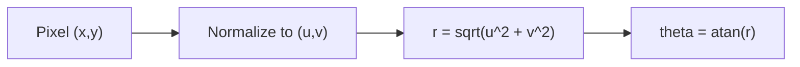

# Linear Algebra Foundations (with derivations)

This module builds the minimum math vocabulary needed to understand the fisheye model used by this project. We emphasize **derivations** so you can see where each equation comes from.

**Prerequisites:** none  
**Next:** `08-world-camera-transforms.md`

## 1. Coordinate systems we use

We use three coordinate systems:

1. **Pixel coordinates**: `(x, y)` in `[0, width) × [0, height)`
2. **Normalized image coordinates**: `(u, v)` in `[-1, 1] × [-1, 1]`
3. **Camera ray coordinates**: a 3D ray direction `(X, Y, Z)` from the lens center

The camera is assumed to look along the **positive Z axis**.


Attribution: Wikimedia Commons, “Spherical coordinate system” (CC BY-SA 4.0), https://commons.wikimedia.org/wiki/File:Spherical_coordinate_system.svg

## 2. From pixel to normalized image coordinates

We center the coordinate system and normalize:

```
u = (x / width  - 0.5) * 2
v = (y / height - 0.5) * 2
```

**Why this formula?**

- `x / width` maps pixels to `[0, 1]`
- subtracting `0.5` centers around `0`
- multiplying by `2` maps to `[-1, 1]`

This step is purely geometric and independent of the lens model.

## 3. Vector length and radius

The radius from the lens center is:

```
r = sqrt(u^2 + v^2)
```

This is the **Euclidean norm** of the vector `(u, v)`. In fisheye.js, this radius is the input to the fisheye model.

## 4. From 2D radius to a 3D ray

Assume a ray direction `(X, Y, Z)` from the lens center. The **optical axis** is the Z axis, so the angle `theta` between the ray and the axis satisfies:

```
cos(theta) = Z / sqrt(X^2 + Y^2 + Z^2)
```

If the ray is normalized (unit length), `sqrt(X^2 + Y^2 + Z^2) = 1` and:

```
cos(theta) = Z
```

The projection onto the image plane is given by `r = sqrt(X^2 + Y^2) / Z`, which leads to:

```
theta = atan(r)
```

This is the key connection between the **2D radius** and the **3D angle**.

## 5. Dot product as angle derivation

For two unit vectors `a` and `b`:

```
a · b = cos(angle)
```

If `b` is the optical axis `(0, 0, 1)`, then:

```
a · b = a_z = cos(theta)
```

This is another way to see why the angle depends on the Z component.

## 6. Why we care about transforms

The fisheye model is a **mapping function** from one radius to another. The GPU shader applies this mapping per pixel, so the idea of “mapping between spaces” is the core concept behind dewarping.

## Visual summary



## What to remember

- **Normalization** makes pixels comparable across resolutions.
- **Radius** is a vector length in normalized coordinates.
- **Angle** is derived from geometry: `theta = atan(r)`.
