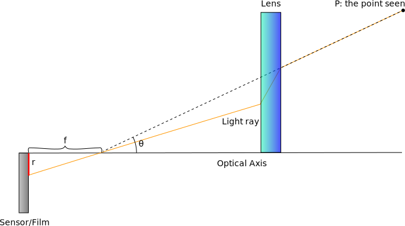
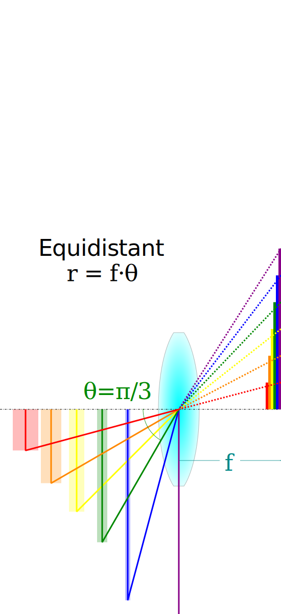
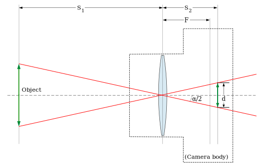

# Camera and Lens Basics (with derivations)

This module explains how a camera lens maps real-world directions onto a 2D image. The central idea is that a lens converts **ray angle** into **image radius**.

**Prerequisites:** `08-world-camera-transforms.md`  
**Next:** `10-calibration-intrinsics-extrinsics.md`

## 1. Ray, angle, and radius

Let a ray direction be `(X, Y, Z)` with optical axis along +Z. The angle between the ray and the optical axis is `theta`. The distance from the image center is `r`. A **lens model** is a function:

```
r = f(theta)
```

Different lenses choose different `f`.



Attribution: Wikimedia Commons, “Fisheye mapping function illustration” (CC BY-SA 3.0), https://commons.wikimedia.org/wiki/File:Fisheye_mapping_function_illustration.svg

## 2. Perspective (pinhole) derivation

For a pinhole camera, the image plane is at distance `f` from the pinhole. By similar triangles:

```
tan(theta) = r / f
```

So:

```
r = f * tan(theta)
```

If you use normalized coordinates where `f = 1`, then:

```
r = tan(theta)
```

This is the standard perspective projection.


Attribution: Wikimedia Commons, “Pinhole-camera.svg” (Public Domain), https://commons.wikimedia.org/wiki/File:Pinhole-camera.svg

## 3. Fisheye mappings (why they differ)

Fisheye lenses capture very wide angles, so `tan(theta)` grows too fast near 90°. Fisheye models pick different mappings, such as:

- **Equidistant**: `r = f * theta`
- **Equisolid**: `r = 2f * sin(theta / 2)`
- **Orthographic**: `r = f * sin(theta)`
- **Stereographic**: `r = 2f * tan(theta / 2)`

These are different choices of `f(theta)`.



Attribution: Wikimedia Commons, “Lens mapping functions” (CC BY-SA 4.0), https://commons.wikimedia.org/wiki/File:Lens_mapping_functions.svg

## 3.1 Equidistant projection (derivation)

For an equidistant fisheye, the defining rule is:

```
r = f * theta
```

This means **equal changes in angle produce equal changes in radius**. It can be derived by assuming the lens is designed to keep angular spacing linear on the sensor. This is the baseline that the OpenCV fisheye model extends with a polynomial.

## 3.2 Perspective vs equidistant (intuition)

- Perspective: `r = f * tan(theta)` grows rapidly near 90°.
- Equidistant: `r = f * theta` grows linearly and is stable at wide angles.

This is why fisheye models are preferred for very wide fields of view.

### 3.3 Quick numeric contrast

With `f = 1`:

```
theta = 75°  -> tan(theta) ≈ 3.732, equidistant r = 1.309
theta = 85°  -> tan(theta) ≈ 11.430, equidistant r = 1.484
```

Perspective expands too fast near the edge, which is why fisheye models avoid `tan`.

## 4. Field of view (FOV) and scaling

FOV defines the maximum `theta` you want to include. If the output corner corresponds to `theta = FOV / 2`, then the scale factor can be chosen so that:

```
r_corner = f(FOV / 2)
```

In fisheye.js, we scale the normalized radius so output corners map to the requested FOV.



Attribution: Wikimedia Commons, “Lens angle of view” (CC BY-SA 3.0), https://commons.wikimedia.org/wiki/File:Lens_angle_of_view.svg

### 4.1 Camera types by FOV (intuition)

- **Telephoto**: narrow FOV (small angle) -> smaller image area, less distortion.
- **Normal**: moderate FOV, similar to human vision perspective.
- **Wide-angle**: large FOV, straight lines bend near edges in perspective.
- **Fisheye**: very large FOV (often 180° or more), requires fisheye mapping.

### 4.2 Quick numeric FOV intuition

If `f` is fixed and sensor size grows, FOV grows:

```
FOV ≈ 2 * atan(sensor_width / (2f))
```

This is why larger sensors or shorter focal lengths produce wider views.

## 5. Lens center offsets

Real lenses are rarely perfectly centered. We correct by shifting:

```
centered = (u - centerX, v - centerY)
```

This means the radius and angle are computed around the **actual** lens center.

## 6. Zoom

Zoom is applied after distortion:

```
r_scaled = r_d / zoom
```

This is not a lens model by itself; it is a post-scaling step to control framing.

## 7. Vignetting and valid image region

**Vignetting** is brightness falloff toward the edges of the image. It is common in wide-angle lenses and can be used to identify the usable region of a fisheye image.


Attribution: Wikimedia Commons, “Woy Woy Channel - Vignetted” (CC BY-SA 4.0), https://commons.wikimedia.org/wiki/File:Woy_Woy_Channel_-_Vignetted.jpg

### 7.1 Detecting the vignetting boundary (practical method)

1. Convert the image to grayscale.
2. Compute the radial profile of brightness around the lens center.
3. Find the radius where brightness falls below a threshold (e.g., 20–30% of center brightness).
4. Define the **valid region** as the circle inside that radius.

This boundary is typically close to the physical image circle of the lens.

## Visual pipeline


## What to remember

- Perspective is derived from **similar triangles**.
- Fisheye models are alternative `f(theta)` mappings.
- FOV chooses how far in angle space you map.
- Center offsets and zoom are post-geometry corrections.
