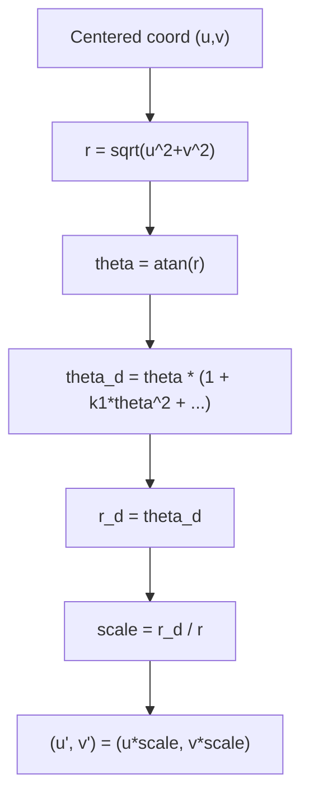

# OpenCV Fisheye Model Math (derivation-focused)

fisheye.js implements the OpenCV fisheye (Kannala–Brandt) model. This section derives the formulas used in the shader and tests.

**Prerequisites:** `09-generic-camera-model-valid-region.md`  
**Next:** `04-project-pipeline.md`


Attribution: Wikimedia Commons, “Fisheye mapping function illustration” (CC BY-SA 3.0), https://commons.wikimedia.org/wiki/File:Fisheye_mapping_function_illustration.svg

## 1. Geometry: angle from normalized radius

From normalized coordinates `(u, v)` centered at the lens:

```
r = sqrt(u^2 + v^2)
```

For a ray at angle `theta` from the optical axis, the perspective relation is:

```
tan(theta) = r
```

Therefore:

```
theta = atan(r)
```

This is **geometric** and does not yet include fisheye distortion.

## 2. Why the mapping is a polynomial in theta

Let the lens mapping be a function of angle:

```
r_d = f(theta)
```

Physical symmetry implies:

- The mapping depends only on `theta`, not on direction angle.
- The mapping is **odd**: flipping the sign of `theta` flips the sign of `r_d`.

An odd function can be represented by a power series of odd powers:

```
r_d = theta + a1*theta^3 + a2*theta^5 + a3*theta^7 + a4*theta^9 + ...
```

OpenCV truncates this series after the `theta^9` term.

## 3. OpenCV fisheye (Kannala–Brandt) form

OpenCV writes the polynomial as:

```
theta_d = theta * (1 + k1*theta^2 + k2*theta^4 + k3*theta^6 + k4*theta^8)
```

Expanding this gives the odd-power series:

```
theta_d = theta + k1*theta^3 + k2*theta^5 + k3*theta^7 + k4*theta^9
```

So the `k1..k4` values are the coefficients of the odd series terms.

## 4. Why r_d = theta_d in OpenCV fisheye

The OpenCV fisheye model is based on an **equidistant** baseline: radius is proportional to angle. The polynomial above models deviation from the ideal equidistant lens. Therefore the distorted radius is:

```
r_d = theta_d
```

This is the critical convention used in this project (and tested in `fisheye.spec.ts`). We do **not** use `tan(theta_d)` here.

### 4.1 Why equidistant is chosen (intuition)

Perspective uses `r = tan(theta)`, which grows rapidly near 90°. For wide‑angle lenses, this creates extreme stretching near the edges and is a poor fit to real fisheye lenses.

Equidistant uses:

```
r = f * theta
```

This keeps angular spacing **linear**, which matches how many fisheye lenses are designed and makes calibration more stable.

### 4.2 Numeric comparison (tan vs equidistant)

Assume `f = 1`:

```
theta = 60°  -> tan(theta) ≈ 1.732,  equidistant r = 1.047
theta = 85°  -> tan(theta) ≈ 11.430, equidistant r = 1.484
```

The perspective radius explodes near 90°, while equidistant remains bounded and smooth.

## 7. From calibration data to k1..k4 (least squares sketch)

Given observed pairs `(theta_i, r_d_i)`, we fit:

```
r_d_i ≈ theta_i + k1*theta_i^3 + k2*theta_i^5 + k3*theta_i^7 + k4*theta_i^9
```

This is linear in the unknowns `k1..k4`, so it can be solved with least squares.

Define matrix `A` and vector `b`:

```
A_i = [ theta_i^3, theta_i^5, theta_i^7, theta_i^9 ]
b_i = r_d_i - theta_i
```

Then solve:

```
min || A k - b ||^2
```

This is how calibration estimates the coefficients from measurements.

## 5. From r_d back to a 2D point

We scale the direction vector:

```
scale = r_d / r
u' = u * scale
v' = v * scale
```

If `r` is near zero, we keep `(u', v') = (0, 0)` to avoid division by zero.

## 6. Coefficient intuition

- `k1` controls the main curvature (most visible effect).
- `k2..k4` refine the curve near the edges.
- The model is **calibration-driven**: coefficients are fit to real data.

Practical notes from this repo:

- Typical `k1` range is about `-1.0` to `1.0`.
- Do not reuse coefficients from other models (e.g. radial polynomial, UCM).

## Visual summary



## What to remember

- The mapping is derived from an **odd power series in theta**.
- OpenCV fisheye uses **r_d = theta_d**, not `tan(theta_d)`.
- Coefficients are calibration parameters, not arbitrary knobs.
