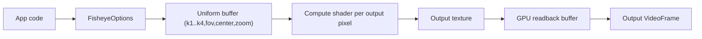

# Project Mapping Pipeline (step-by-step)

This module walks through how fisheye.js transforms a `VideoFrame` using WebGPU compute shaders and the OpenCV fisheye model.

**Prerequisites:** `03-fisheye-model-math.md`  
**Next:** `05-configuration-tuning.md`


Attribution: Wikimedia Commons, “Fisheye mapping function illustration” (CC BY-SA 3.0), https://commons.wikimedia.org/wiki/File:Fisheye_mapping_function_illustration.svg

## 1. High-level pipeline

1. Create a `Fisheye` instance with config (k1..k4, fov, center, zoom, output size).
2. Initialize GPU resources (uniform buffer, input/output textures).
3. Run a compute shader that maps each output pixel to an input sample.
4. Read back the output texture into a `VideoFrame`.



## 2. Uniforms and parameters (from `src/fisheye.ts`)

The shader uses a uniform struct containing:

- `k1..k4` distortion coefficients
- `fov` in degrees
- `centerX`, `centerY` offsets
- `zoom` factor
- `width`, `height` output size
- `inputWidth`, `inputHeight` input size

The CPU side updates these values when you call `updateConfig()` or when a new input frame size is detected.

## 3. Per-pixel mapping derivation

For each output pixel `(x, y)`:

### Step 1: Normalize pixel coordinates

```
u = (x / width  - 0.5) * 2
v = (y / height - 0.5) * 2
```

### Step 2: Center shift

```
u_c = u - centerX
v_c = v - centerY
r = sqrt(u_c^2 + v_c^2)
```

### Step 3: FOV scaling

The shader scales `r` so that the output corner corresponds to `FOV / 2`. Since the corner in normalized space has radius `sqrt(2)`:

```
scale_raw = tan((fov_rad / 2)) / sqrt(2)
scale = min(scale_raw, 1.0)
r_fov = r * scale
```

### Step 4: Angle and fisheye polynomial

```
theta = atan(r_fov)
theta_d = theta * (1 + k1*theta^2 + k2*theta^4 + k3*theta^6 + k4*theta^8)
```

### Step 5: Distorted radius and zoom

```
r_d = theta_d
r_zoom = r_d / zoom
```

### Step 6: Map to input texture

```
scale = r_zoom / r
u' = u_c * scale
v' = v_c * scale
```

Then convert back to texture coordinates and sample the input texture.

## 4. Parallelism and performance

Each output pixel is computed independently, which makes this a perfect fit for a compute shader. The GPU executes thousands of these mappings in parallel.

## What to remember

- The pipeline is **output-driven**: each output pixel samples an input pixel.
- The FOV scaling step ties geometry to the requested viewing angle.
- The polynomial matches the OpenCV fisheye model exactly.
