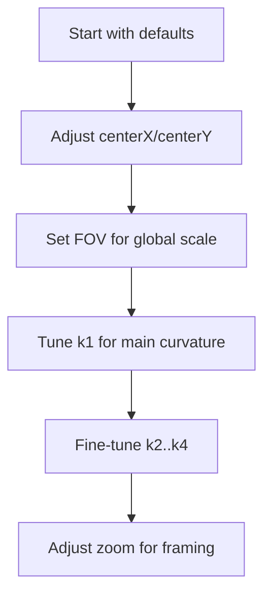

# Configuration and Tuning Guide (with calibration context)

This module explains how each configuration parameter affects fisheye dewarping and how those parameters are **derived** or **tuned**.

**Prerequisites:** `11-end-to-end-pipeline.md`  
**Next:** `07-gpu-rendering-typegpu.md`


Attribution: Wikimedia Commons, “Lens mapping functions” (CC BY-SA 4.0), https://commons.wikimedia.org/wiki/File:Lens_mapping_functions.svg

## 1. Parameters and meanings

- `k1..k4`: OpenCV fisheye distortion coefficients.
  - Typical `k1` range: about `-1.0` to `1.0`.
  - These coefficients define the polynomial:
    ```
    theta_d = theta + k1*theta^3 + k2*theta^5 + k3*theta^7 + k4*theta^9
    ```
- `fov`: Field of view in degrees.
  - Common values: `120` to `200`.
  - Used to scale the normalized radius so the corner maps to `FOV/2`.
- `centerX`, `centerY`: Lens center offsets in normalized coordinates.
  - Range `-1.0` to `1.0`.
  - Applied before radial mapping so the radius is computed around the correct center.
- `zoom`: Scales the distorted radius after correction.
  - `zoom > 1` zooms in, cropping edges.
  - `zoom < 1` zooms out, showing more edge area.
- `width`, `height`: Output resolution of the dewarped frame.

## 2. Where k1..k4 come from (derivation path)

In camera calibration, you typically have:

- A set of 3D points (like a chessboard in real space)
- Their corresponding observed 2D points in the image

For each point, the angle `theta` from the optical axis can be computed based on the estimated camera pose. The measured 2D radius gives you `r_d`. The model says:

```
r_d = theta + k1*theta^3 + k2*theta^5 + k3*theta^7 + k4*theta^9
```

This becomes a **least squares fitting problem** for `k1..k4`:

```
minimize sum_i ( r_d(i) - (theta_i + k1*theta_i^3 + ... + k4*theta_i^9) )^2
```

So the coefficients are not arbitrary; they are **fit parameters** derived from calibration data.

## 3. Start with known calibration

If you have calibration parameters from OpenCV `fisheye::calibrate`, use them directly. Do not mix coefficients from other fisheye or radial models.

## 4. Manual tuning workflow

If you do not have calibration data, adjust in this order:

1. **Center offsets** (`centerX`, `centerY`)
2. **FOV**
3. **k1**, then **k2..k4**
4. **zoom** for final framing



## 5. Common symptoms and fixes

- **Straight lines still curve**: adjust `k1` slightly (small steps).
- **Image feels too wide/narrow**: adjust `fov`.
- **Warp is off-center**: adjust `centerX`, `centerY`.
- **Edges clipped**: reduce `zoom` or reduce `fov`.

## 6. Example config

```ts
const dewarper = new Fisheye({
  k1: 0.3,
  k2: 0.0,
  k3: 0.0,
  k4: 0.0,
  fov: 180,
  centerX: 0,
  centerY: 0,
  zoom: 1.0,
  width: 1280,
  height: 720,
});
```

## What to remember

- `k1..k4` are **calibration coefficients**, not simple knobs.
- FOV sets the global angle scale.
- Center offsets should be fixed before fine curvature tuning.
