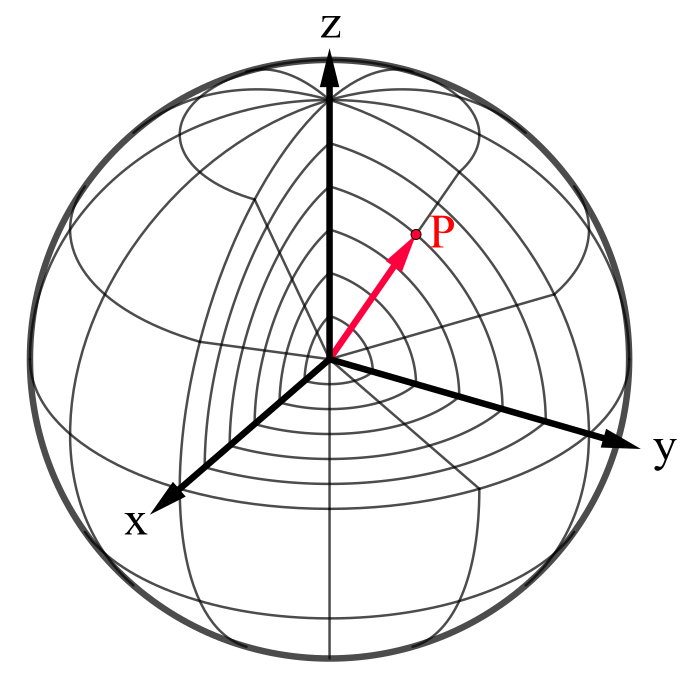
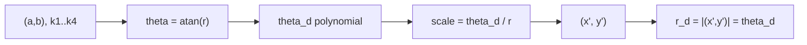

# Validation and Testing (math correctness)

This module explains how the project validates the fisheye model and the GPU pipeline to ensure the derivations are implemented correctly.

**Prerequisites:** `07-gpu-rendering-typegpu.md`  
**Next:** end



Attribution: Wikimedia Commons, “Spherical coordinate system” (CC BY-SA 4.0), https://commons.wikimedia.org/wiki/File:Spherical_coordinate_system.svg

## 1. Why validation matters

Fisheye models differ by convention. A single mistake (for example using `tan(theta_d)` instead of `theta_d`) produces a visually plausible but **wrong** result. Tests encode the correct convention.

## 2. Reference implementation used for tests

In `src/fisheye.spec.ts`, the test function `opencvFisheyeForward()` computes:

```
theta = atan(r)
theta_d = theta + k1*theta^3 + k2*theta^5 + k3*theta^7 + k4*theta^9
scale = theta_d / r
(x', y') = scale * (a, b)
```

Then it checks that:

```
r_d = sqrt(x'^2 + y'^2) = theta_d
```

This is the formal OpenCV fisheye rule used by the project.



## 3. End-to-end validation

The `test/dewarp.spec.ts` test renders a full dewarp and compares against known-good fixtures. This detects:

- Shader regressions or math mistakes
- Resource binding bugs
- Incorrect uniform updates or texture sizes

## 4. When tests fail, what to inspect

1. **Model mismatch**: check the polynomial and the `r_d = theta_d` convention.
2. **Uniform values**: verify that `k1..k4`, `fov`, `center`, and `zoom` are correct.
3. **FOV scaling**: confirm the corner scaling (`sqrt(2)` factor) is applied.

## What to remember

- Tests encode the **derivation** in executable form.
- If tests pass, the implementation matches the intended model.
