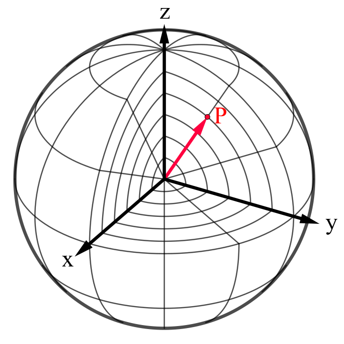
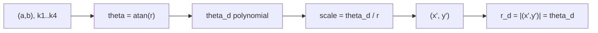

# Validation and Testing (math correctness)

This module explains how the project validates the fisheye model and the GPU pipeline to ensure the derivations are implemented correctly.

**Prerequisites:** `07-gpu-rendering-typegpu.md`  
**Next:** end



Attribution: Wikimedia Commons, “Spherical coordinate system” (CC BY-SA 4.0), https://commons.wikimedia.org/wiki/File:Spherical_coordinate_system.svg

## 1. Why validation matters

Fisheye models differ by convention. A single mistake (for example using `tan(theta_d)` instead of `theta_d`) produces a visually plausible but **wrong** result. Tests encode the correct convention.

## 2. CPU and native WebGPU coverage

Unit tests validate option normalization and the ONVIF spline independently of the shader. Native GPU tests then run the production TypeGPU compute pipeline using Dawn's Node bindings. CI puts Dawn over Mesa Lavapipe in a pinned Linux container, so correctness does not depend on the runner's physical GPU or browser version.

The OpenCV reference mapping computes:

```
theta = atan(r)
theta_d = theta + k1*theta^3 + k2*theta^5 + k3*theta^7 + k4*theta^9
scale = theta_d / r
(x', y') = scale * (a, b)
```

Then it checks that:

```
r_d = sqrt(x'^2 + y'^2) = theta_d
```

This is the formal OpenCV fisheye rule used by the project.


```mermaid
flowchart LR
  Inputs["(a,b), k1..k4"] --> Theta["theta = atan(r)"]
  Theta --> ThetaD["theta_d polynomial"]
  ThetaD --> Scale["scale = theta_d / r"]
  Scale --> XY["(x', y')"]
  XY --> Check["r_d = |(x',y')| = theta_d"]
```

## 3. Test layers

| Script | Purpose |
| --- | --- |
| `npm run test:unit` | CPU validation, config/API behavior, spline endpoints and invalid inputs |
| `npm run test:gpu` | Production compute shader with an available Dawn adapter |
| `npm run test:gpu:container` | Pinned Dawn + Lavapipe software execution used by CI |
| `npm run test:gpu:repeat` | Ten independent native runs with no retry masking |
| `npm run test:browser` | Small real-`VideoFrame` browser ingress/egress smoke test |

Native tests use generated lossless RGBA pixels and exact or independently calculated expected values. They cover row-padding readback, OpenCV and ONVIF mappings, invalid-ray masking, projections, PTZ, pane output, resizing, and model replacement. GPU validation errors and unexpected device loss fail the suite.

The old large browser/fixture comparison remains available as `npm run test:e2e:legacy`; it is no longer the required CI correctness gate.

- Shader regressions or math mistakes
- Resource binding bugs
- Incorrect uniform updates or texture sizes

## 4. When tests fail, what to inspect

1. **Model mismatch**: check the polynomial and the `r_d = theta_d` convention.
2. **Uniform values**: verify that `k1..k4`, `fov`, `center`, and `zoom` are correct.
3. **Adapter selection**: container runs must report Lavapipe/llvmpipe; missing or hardware adapters are failures.
4. **FOV and coordinate conventions**: confirm degrees/radians, normalized sensor offsets, XFactor, and texel-center mapping.

## What to remember

- Tests encode the **derivation** in executable form.
- Native software-GPU tests remove browser and physical-GPU variability from the core gate.
- Passing synthetic tests is not a substitute for validation against a real ONVIF camera.
