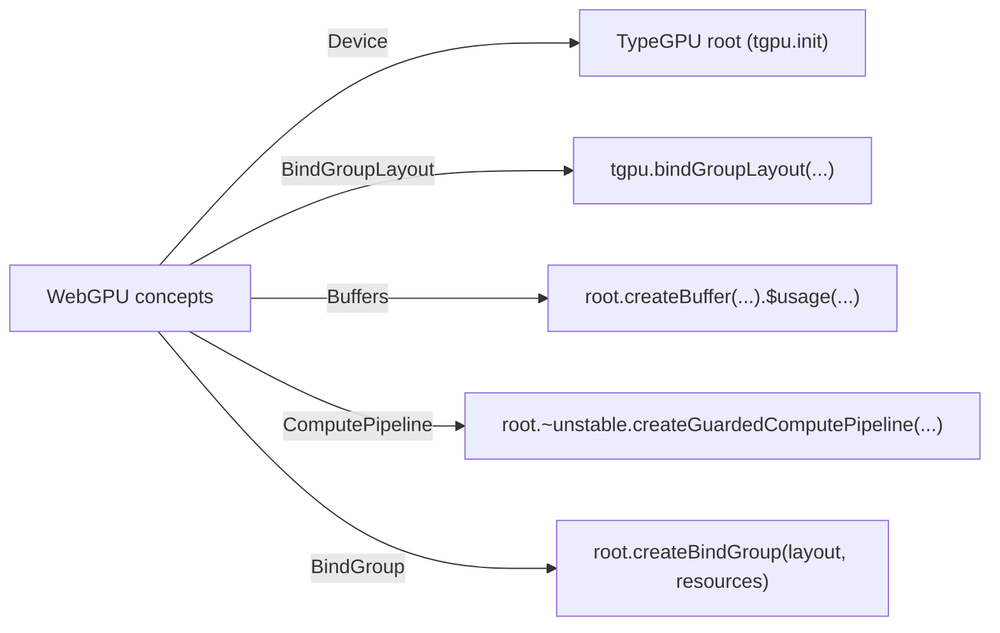

# GPU Rendering and TypeGPU Abstraction (with details)

This module explains how GPU work is executed in WebGPU and how TypeGPU simplifies the workflow used by this project.

**Prerequisites:** `05-configuration-tuning.md`  
**Next:** `06-validation-testing.md`

Attribution: Wikimedia Commons, “Graphics pipeline de” (Public Domain), https://commons.wikimedia.org/wiki/File:Graphics_pipeline_de.svg

Note: the image shows a full render pipeline. fisheye.js uses the **compute** path, which is a simpler subset focused on compute passes and buffer/texture resources.

## 1. WebGPU execution model (compute path)

WebGPU is a command-based API. For compute work, the conceptual steps are:

1. **Create a device** and a **queue**.
2. **Allocate resources** (buffers, textures).
3. **Define a bind group layout** (what the shader expects).
4. **Create a compute pipeline** (shader + layout).
5. **Encode commands** (compute pass) and submit them.

Typical command flow in WebGPU:

- `device.createCommandEncoder()`
- `encoder.beginComputePass()`
- `pass.setPipeline(pipeline)`
- `pass.setBindGroup(0, bindGroup)`
- `pass.dispatchWorkgroups(...)`
- `pass.end()`
- `device.queue.submit([encoder.finish()])`

This is the underlying flow that TypeGPU wraps.

## 2. TypeGPU abstractions used here

TypeGPU adds **typed layouts** and **typed resource access**:

- `d.struct(...)` defines a uniform buffer shape.
- `tgpu.bindGroupLayout(...)` defines bindings with types.
- `root.createBuffer(...)` creates buffers with a data schema.
- `createGuardedComputePipeline(...)` creates a compute pipeline from a TypeScript function.
- `layout.$` gives typed access to buffers/textures inside shader code.

These eliminate a large class of “layout mismatch” bugs.

## 3. Mapping WebGPU concepts to TypeGPU

## 4. How fisheye.js uses TypeGPU

At a high level:

1. **Define layout**: input texture, output texture, and uniform buffer.
2. **Create buffers/textures**: size and usage are inferred from TypeGPU data types.
3. **Create compute pipeline**: write the shader in TypeScript with `"use gpu"`.
4. **Bind resources**: `layout.$` gives typed access to uniforms and textures.
5. **Dispatch threads**: one thread per output pixel.

This gives us a minimal and safe compute pipeline to run the dewarp math in parallel.

## 5. Key official references (Context7)

- TypeGPU bind group layouts and typed access: https://context7.com/software-mansion/typegpu/llms.txt
- TypeGPU pipelines and guarded compute pipelines: https://context7.com/software-mansion/typegpu/llms.txt
- WebGPU command encoding and compute pipeline basics: https://context7.com/gpuweb/gpuweb/llms.txt

## What to remember

- WebGPU is **encode → submit**.
- TypeGPU provides **typed resource layouts** and **TypeScript shader access**.
- fisheye.js uses **compute shaders**, not render pipelines.
