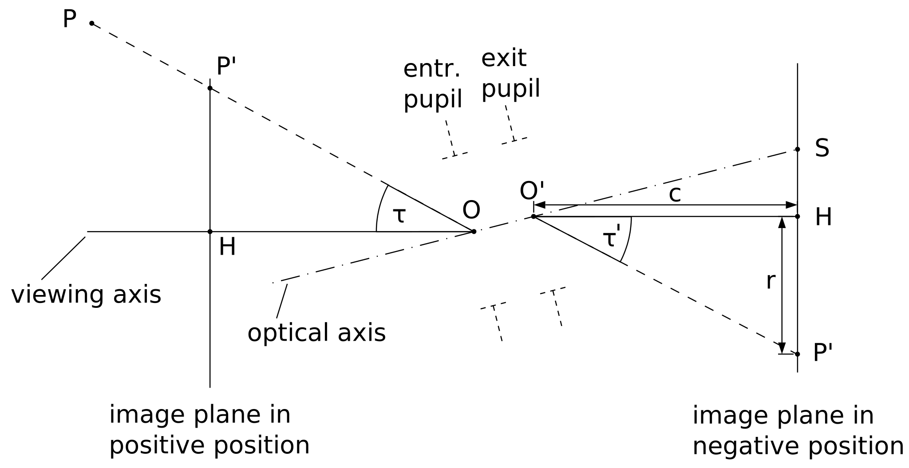
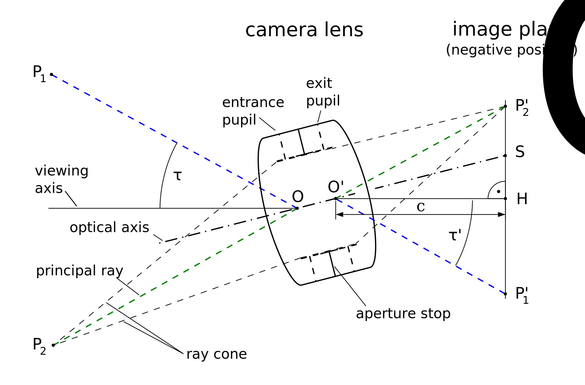

# World Space and Camera Space Transforms (with derivations)

This module teaches how **world space** and **camera space** are related using matrix operations. The goal is for a first-year student who just learned linear algebra to derive the formulas step by step.

**Prerequisites:** `01-linear-algebra-foundations.md`  
**Next:** `02-camera-lens-basics.md`



Attribution: Wikimedia Commons, “Central projection of a real camera” (CC BY-SA 4.0), https://commons.wikimedia.org/wiki/File:Central_projection_of_a_real_camera.svg



Attribution: Wikimedia Commons, “Principles of imaging geometry of a camera” (CC BY-SA 4.0), https://commons.wikimedia.org/wiki/File:Principles_of_imaging_geometry_of_a_camera.svg

## 1. Coordinate frames and basis vectors

Any coordinate system can be described by **basis vectors**:

- World basis: `X_w = (1,0,0)`, `Y_w = (0,1,0)`, `Z_w = (0,0,1)`
- Camera basis: `X_c`, `Y_c`, `Z_c` (the camera's right, up, forward)

If you stack the camera basis vectors as columns in a matrix:

```
R = [ X_c  Y_c  Z_c ]
```

then `R` **rotates** a vector from camera space into world space. Its inverse `R^-1` rotates world into camera space.

Because `R` is a pure rotation, it is orthonormal, so:

```
R^-1 = R^T
```

## 2. Deriving the 2D rotation matrix

Let a vector `(x, y)` rotate by angle `theta` to `(x', y')`. Using the unit circle:

```
x' = x cos(theta) - y sin(theta)
y' = x sin(theta) + y cos(theta)
```

This can be written as a matrix:

```
[x']   [ cos(theta)  -sin(theta) ] [x]
[y'] = [ sin(theta)   cos(theta) ] [y]
```

This is the 2D rotation matrix.

## 3. 2D translation via homogeneous coordinates

Translation cannot be written as a 2x2 matrix multiply. We add a dimension:

```
[x']   [ 1  0  tx ] [x]
[y'] = [ 0  1  ty ] [y]
[1 ]   [ 0  0   1 ] [1]
```

This 3x3 matrix performs translation by `(tx, ty)`.

## 4. 3D rotation matrices

In 3D, rotations around axes are:

```
Rx(theta) = [ 1     0            0
              0  cos(theta)  -sin(theta)
              0  sin(theta)   cos(theta) ]

Ry(theta) = [  cos(theta)  0  sin(theta)
               0           1   0
             -sin(theta)  0  cos(theta) ]

Rz(theta) = [ cos(theta)  -sin(theta)  0
              sin(theta)   cos(theta)  0
              0            0           1 ]
```

A general 3D rotation can be built by multiplying these in a chosen order.

## 5. World -> camera derivation (extrinsics)

Let:

- `C` be the camera center in world coordinates
- `R` be the rotation matrix whose columns are camera basis vectors

To express a world point `X_w` in camera coordinates:

1. **Translate** world point to camera origin:
   ```
   X_w' = X_w - C
   ```
2. **Rotate** into camera basis:
   ```
   X_c = R^T * X_w'
   ```

So:

```
X_c = R^T (X_w - C)
```

This is the standard **extrinsic transform**.

Define:

```
t = -R^T C
```

Then:

```
X_c = R^T X_w + t
```

## 6. Homogeneous 4x4 form

Using homogeneous coordinates `(x, y, z, 1)`:

```
[X_c]   [ R^T  t ] [X_w]
[ 1 ] = [ 0    1 ] [ 1 ]
```

This 4x4 matrix combines rotation and translation into a single linear transform.

## 7. Camera -> world (inverse transform)

The inverse is:

```
X_w = R X_c + C
```

Because `R` is orthonormal, the inverse rotation is just `R` (not `R^T`) when going from camera to world.

## 8. Connection to projection

For a pinhole camera, a 3D camera-space point `(X_c, Y_c, Z_c)` projects to:

```
x = X_c / Z_c
y = Y_c / Z_c
```

This gives normalized image coordinates `(x, y)`. fisheye.js then converts these to `r = sqrt(x^2 + y^2)` and uses the fisheye model to map angle to radius.

So the full pipeline is:

```
World point -> camera transform -> normalized coordinates -> fisheye mapping
```


## 9. Worked 2D example (from scratch)

Let a 2D camera be at `C = (2, 1)` and rotated by `theta = 90°`. For a world point `X_w = (3, 1)`:

1. Translate: `X_w' = (3,1) - (2,1) = (1,0)`
2. Rotate 90°:
   ```
   R(90°) = [ 0 -1
              1  0 ]
   ```
   ```
   X_c = R^T X_w' = [ 0 1
                      -1 0 ] [1,0] = (0, -1)
   ```

So the point ends up at `(0, -1)` in camera coordinates.

## 10. Worked 3D example (numeric)

Let:

- Camera center `C = (1, 2, 3)`
- Camera basis (world axes) be a 90° rotation around Z:
  ```
  R = [ 0 -1  0
        1  0  0
        0  0  1 ]
  ```
- World point `X_w = (2, 4, 3)`

Step 1: translate to camera origin:

```
X_w' = X_w - C = (1, 2, 0)
```

Step 2: rotate into camera frame:

```
R^T = [ 0  1  0
       -1  0  0
        0  0  1 ]
```

```
X_c = R^T X_w' = (2, -1, 0)
```

So in camera coordinates, the point is `(2, -1, 0)`. The sign flip is exactly what a 90° rotation should produce.

## What to remember

- Rotation matrices are **basis changes**.
- World -> camera uses `R^T (X_w - C)`.
- Homogeneous coordinates let you combine rotation + translation.
