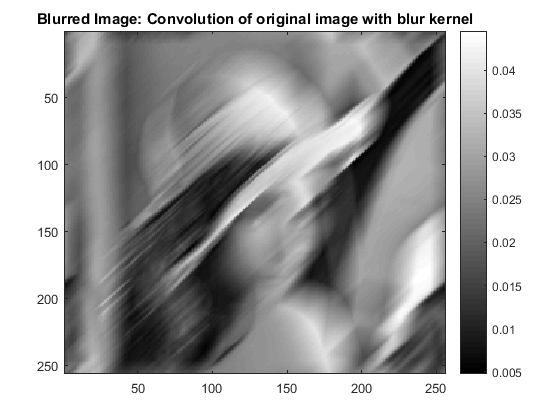
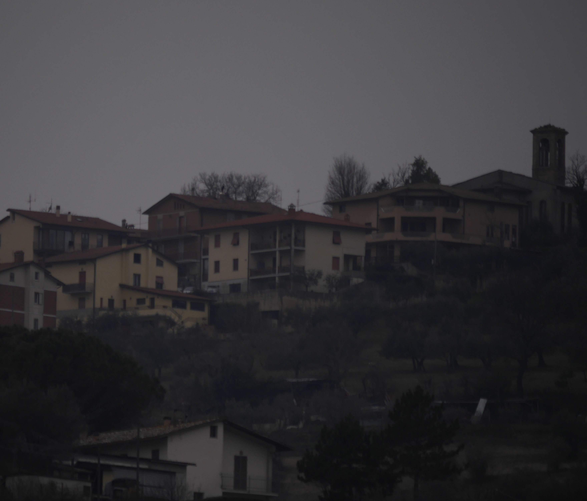

# Calibration: Intrinsics, Extrinsics, and Pose (step-by-step)

This module explains **camera calibration** from the ground up: how intrinsics and extrinsics are defined, how they are derived, how to update intrinsics when you crop or resize images, and how to interpret rotation/translation in practice.

**Prerequisites:** `02-camera-lens-basics.md`  
**Next:** `09-generic-camera-model-valid-region.md`

## 1. Why calibration exists

Calibration answers two questions:

1. **How does the camera project 3D to 2D?** (intrinsics)
2. **Where is the camera in the world?** (extrinsics)

The calibrated camera model is the bridge between **geometry** and **pixels**.

## 2. Intrinsic matrix K (what it means)

For a 3D point in camera coordinates `(X_c, Y_c, Z_c)`, the ideal pinhole projection is:

```
x = X_c / Z_c
y = Y_c / Z_c
```

Then intrinsics map normalized `(x, y)` into pixels `(u, v)`:

```
K = [ fx  0  cx
      0  fy  cy
      0   0   1 ]
```

```
[u]   [fx  0  cx] [x]
[v] = [ 0 fy  cy] [y]
[1]   [ 0  0   1] [1]
```

### 2.1 How K is derived

- `fx = f / s_x` where `f` is focal length and `s_x` is pixel size in x.
- `fy = f / s_y` where `s_y` is pixel size in y.
- `(cx, cy)` is the principal point (projection of optical axis on the image).

So **intrinsics are the physical lens + sensor geometry expressed in pixels**.

## 3. Extrinsic matrix [R | t] (what it means)

Extrinsics convert **world coordinates** to **camera coordinates**.

Let:

- `C` = camera center in world coordinates
- `R` = rotation from camera basis to world basis

Then for a world point `X_w`:

```
X_c = R^T (X_w - C)
```

Define:

```
t = -R^T C
```

Then:

```
X_c = R^T X_w + t
```

So the extrinsic matrix is:

```
[R^T | t]
```

## 4. Full projection equation (homogeneous)

Combine intrinsics and extrinsics:

```
P = K [R^T | t]
```

For a world point in homogeneous coordinates `(X_w, Y_w, Z_w, 1)`:

```
s * [u v 1]^T = P * [X_w Y_w Z_w 1]^T
```

This is the standard **camera projection model**.

## 5. Updating intrinsics for crop and resize

Calibration is valid for the image size used. If you crop or resize, you must adjust `K`.

### 5.1 Resize (scale by sx, sy)

If you resize the image by `sx` (width) and `sy` (height):

```
fx' = fx * sx
fy' = fy * sy
cx' = cx * sx
cy' = cy * sy
```

### 5.2 Crop (offset by dx, dy)

If you crop starting at `(dx, dy)` from the top-left:

```
cx' = cx - dx
cy' = cy - dy
```

`fx` and `fy` do not change for a pure crop.

### 5.3 Crop then resize

Do crop first, then apply resize scaling:

```
cx' = (cx - dx) * sx
cy' = (cy - dy) * sy
fx' = fx * sx
fy' = fy * sy
```

### 5.4 Numeric example (crop + resize)

Assume:

- Original image: 1280x720
- `fx = 900`, `fy = 900`, `cx = 640`, `cy = 360`
- Crop: `(dx, dy) = (100, 50)` to size 1000x600
- Resize to 500x300, so `sx = 0.5`, `sy = 0.5`

Step 1: crop:

```
cx_crop = 640 - 100 = 540
cy_crop = 360 - 50 = 310
```

Step 2: resize:

```
fx' = 900 * 0.5 = 450
fy' = 900 * 0.5 = 450
cx' = 540 * 0.5 = 270
cy' = 310 * 0.5 = 155
```

Final intrinsics:

```
fx' = 450, fy' = 450, cx' = 270, cy' = 155
```

## 6. Pose from rotation + translation

Extrinsics encode pose:

- **Rotation** gives camera orientation
- **Translation** gives camera position

If you have `[R^T | t]`, you can recover camera center:

```
C = -R t
```

This tells you where the camera sits in world coordinates.

## 6.1 Numeric pose example (recover camera center)

Let:

```
R = [ 1  0  0
      0  0 -1
      0  1  0 ]
t = [ 0.5, -1.0, 2.0 ]^T
```

Then:

```
C = -R t
```

Compute:

```
R t = (0.5, -2.0, -1.0)
C = (-0.5, 2.0, 1.0)
```

So the camera center is at `(-0.5, 2.0, 1.0)` in world coordinates.

## 7. Roll, pitch, yaw (FLU -> RDF)

Different systems use different axis conventions. A common mapping:

- **FLU**: Forward, Left, Up
- **RDF**: Right, Down, Forward

One conversion is a fixed axis swap and sign flip. For example:

```
R_FLU_to_RDF = [ 0 -1  0
                 0  0 -1
                 1  0  0 ]
```

Then:

```
v_RDF = R_FLU_to_RDF * v_FLU
```

Once in a consistent axis convention, roll/pitch/yaw can be extracted from `R` (assuming ZYX order):

```
yaw   = atan2(R21, R11)
pitch = asin(-R31)
roll  = atan2(R32, R33)
```

This is a standard decomposition; the order must match your convention.

### 7.1 Practical mount interpretation example

If you extract:

```
roll  = 1.5°
pitch = -2.1°
yaw   = 0.3°
```

Then the camera is:

- Rolled slightly clockwise
- Pitched downward by about 2 degrees
- Yawed slightly to the right

This helps diagnose sensor mounting errors in the field.

### 7.2 Numeric extraction example (ZYX order)

Assume:

```
R = [ 0.999  0.020  0.030
     -0.019  0.999 -0.040
     -0.031  0.039  0.998 ]
```

Compute (ZYX):

```
yaw   = atan2(R21, R11) = atan2(-0.019, 0.999) ≈ -1.09°
pitch = asin(-R31)      = asin(0.031) ≈ 1.78°
roll  = atan2(R32, R33) = atan2(0.039, 0.998) ≈ 2.24°
```

So the camera is yawed slightly left, pitched slightly up, and rolled slightly clockwise.

## 8. Calibration workflow (checkerboard)

1. Capture 10–30 images of a checkerboard at different angles/distances.
2. Detect corners in each image (sub‑pixel refinement improves accuracy).
3. Solve for intrinsics and distortion coefficients by minimizing reprojection error.
4. Solve for extrinsics per image (camera pose for each view).
5. Validate with a held‑out image: projected points should align with observed corners.

This is the practical process that yields `K`, distortion coefficients, and `R, t`.


Attribution: Wikimedia Commons, “Checkerboard pattern” (Public Domain), https://commons.wikimedia.org/wiki/File:Checkerboard_pattern.svg

## 9. Reprojection error (why optimization works)

Calibration minimizes the reprojection error:

```
e_i = || u_i_observed - u_i_projected ||^2
```

The objective is:

```
minimize sum_i e_i
```

This turns calibration into a least‑squares optimization problem.

### 9.1 Numeric reprojection example

Assume one observed point:

```
u_observed = (500, 300)
u_projected = (492, 308)
```

Then the squared error is:

```
e = (500 - 492)^2 + (300 - 308)^2 = 8^2 + (-8)^2 = 128
```

The optimizer reduces these errors across all points and images.

## 10. Common failure modes (and fixes)

- **All images from same angle**: add more varied viewpoints.
- **Checkerboard too small**: use a larger pattern to increase signal.
- **Blurry corners**: increase shutter speed or use tripod.
- **Wrong axis convention**: verify FLU/RDF mapping before interpreting pose.

### 10.1 Visual examples of failure causes



Attribution: Wikimedia Commons, “Blur img” (CC BY-SA 4.0), https://commons.wikimedia.org/wiki/File:Blur_img.png


Attribution: Wikimedia Commons, “Brightness Contrast Gamma” (CC BY-SA 3.0), https://commons.wikimedia.org/wiki/File:Brightness_Contrast_Gamma.png



Attribution: Wikimedia Commons, “Underexposed photo” (CC BY-SA 4.0), https://commons.wikimedia.org/wiki/File:Underexposed_photo.JPG


Attribution: Wikimedia Commons, “Overexposed photo” (CC BY-SA 4.0), https://commons.wikimedia.org/wiki/File:Overexposed_photo.JPG


Attribution: Wikimedia Commons, “Police Motorcycle motion blur in Manhattan NYC” (CC BY-SA 2.0), https://commons.wikimedia.org/wiki/File:Police_Motorcycle_motion_blur_in_Manhattan_NYC.jpg


Attribution: Wikimedia Commons, “Photo of a tree as overexposed - normal - underexposed” (CC0), https://commons.wikimedia.org/wiki/File:Photo_of_a_tree_as_overexposed_-_normal_-_underexposed.jpg

## 8. Practical interpretation (sensor mount alignment)

If the sensor is tilted or rotated:

- `R` captures the tilt.
- You can compute roll/pitch/yaw to interpret it in degrees.
- This allows you to measure **mount misalignment** (e.g., camera is pitched 2.1° down).

This is useful for:

- verifying sensor installation
- compensating for mounting errors
- comparing calibration results across devices

## 9. Where this fits in fisheye.js

fisheye.js uses a calibrated **lens model** (the OpenCV fisheye polynomial). In a full pipeline, you would:

1. Transform world -> camera (extrinsics)
2. Project to normalized `(x, y)`
3. Apply fisheye mapping to get `(u, v)`
4. Sample the fisheye image

The calibration parameters govern steps 1–3.

## What to remember

- Intrinsics map normalized rays to pixels.
- Extrinsics map world points into the camera frame.
- Crop and resize **must** update K.
- Rotation + translation define camera pose and mounting alignment.
